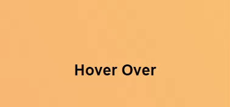

# Tooltip

Tooltip to help user with further information

## Description

Some websites will require tooltip to provide users with more information and here is one that I have created.

[GitHub page](https://github.com/Digita1Panda/tooltip)
[Tooltip](https://digita1panda.github.io/tooltip/)

## Table of Contents

- [Tooltip](#tooltip)
  - [Description](#description)
  - [Table of Contents](#table-of-contents)
  - [Installation](#installation)
  - [Usage](#usage)
  - [License](#license)
  - [Features](#features)
  - [Badges](#badges)

## Installation

- Copy the relevant part of the HTML and CSS code into your own.

## Usage

- Tooltip:

  ```
  Hover over the text. Make sure to put your own content in the <span>.
  ```

<br>
<div align="center">
     
</div>


## License

[](https://opensource.org/licenses/MIT)

MIT License

Copyright & All rights Reserved (c) 2023 Kwok Law

Permission is hereby granted, free of charge, to any person obtaining a copy of this software and associated documentation files (the “Software”), to deal in the Software without restriction, including without limitation the rights to use, copy, modify, merge, publish, distribute, sublicense, and/or sell copies of the Software, and to permit persons to whom the Software is furnished to do so, subject to the following conditions:

The above copyright notice and this permission notice shall be included in all copies or substantial portions of the Software.

THE SOFTWARE IS PROVIDED “AS IS”, WITHOUT WARRANTY OF ANY KIND, EXPRESS OR IMPLIED, INCLUDING BUT NOT LIMITED TO THE WARRANTIES OF MERCHANTABILITY, FITNESS FOR A PARTICULAR PURPOSE AND NONINFRINGEMENT. IN NO EVENT SHALL THE AUTHORS OR COPYRIGHT HOLDERS BE LIABLE FOR ANY CLAIM, DAMAGES OR OTHER LIABILITY, WHETHER IN AN ACTION OF CONTRACT, TORT OR OTHERWISE, ARISING FROM, OUT OF OR IN CONNECTION WITH THE SOFTWARE OR THE USE OR OTHER DEALINGS IN THE SOFTWARE.

---

## Features

Tooltip

## Badges


Copyright © 2023 K.Law All Rights Reserved.
